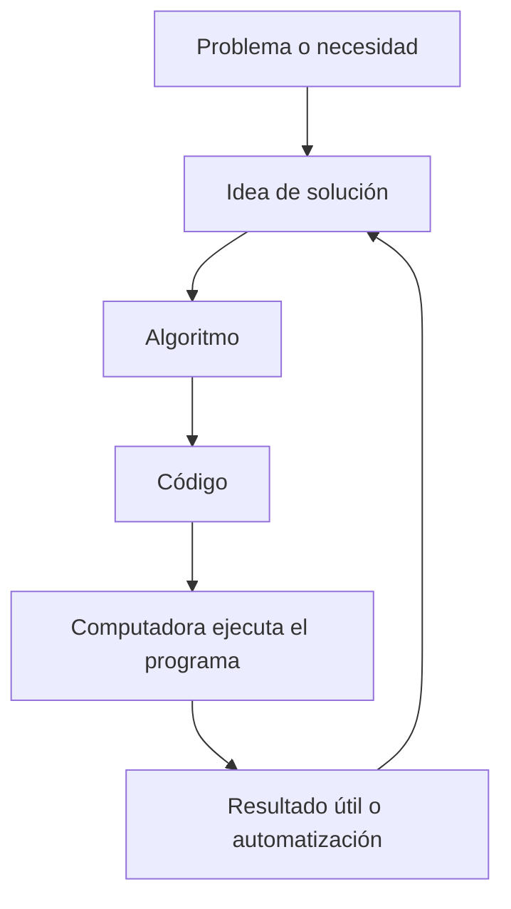
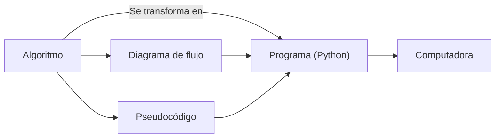

# Parte 2: Algorítmica

**Tabla de contenidos**
* TOC
{:toc}

## Algoritmo

{: .tip-title }
> ¿Qué es un algoritmo?
>
> De acuerdo a la Rae, se define como:
>> *Quizá del lat. tardío *algobarismus, y este abrev. del ár. clás. ḥisābu lḡubār 'cálculo mediante cifras arábigas'.*
>>
>> m. Conjunto ordenado y finito de operaciones que permite hallar la solución de un problema.
    m. Método y notación en las distintas formas del cálculo.

### Idea básica

### Ejecución

lorem ipsum