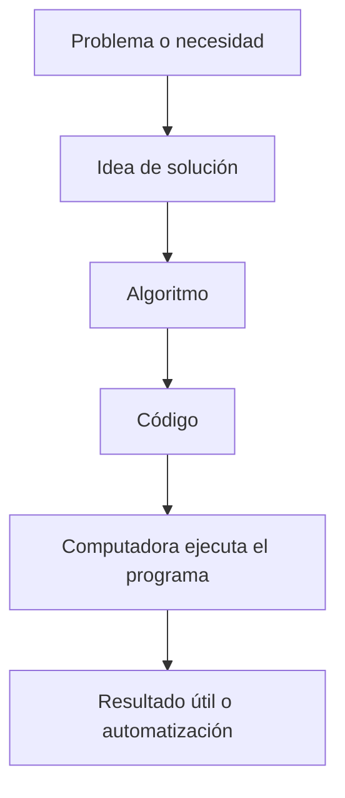

# Parte 1: Programación

**Tabla de contenidos**
* TOC
{:toc}

{: .important-title }
> Concepto clave
>
> Programar es **dar instrucciones precisas y ordenadas a una computadora** para resolver un problema o automatizar una tarea.

Programar no es solo escribir código. Antes de escribir cualquier línea, es necesario entender **qué se quiere resolver** y cómo se podría resolver.

## Flujo general de la programación

{: .tip-title }
> **Ejemplo**
>
> Si quieres calcular el promedio de calificaciones de tus estudiantes, necesitas:
> - Recibir los datos (números)
> - Sumar y dividir
> - Mostrar el resultado

Eso se convierte en un **programa** al escribirlo en un lenguaje que la computadora entienda, como Python.