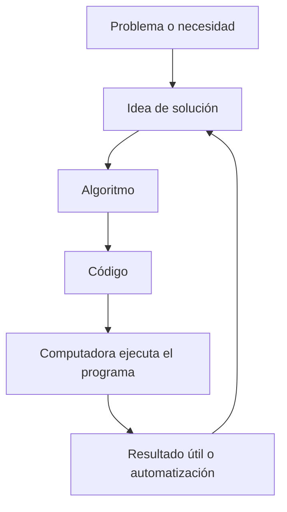
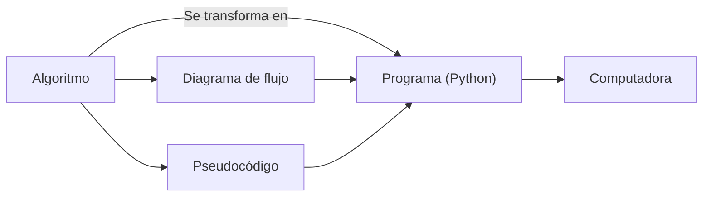
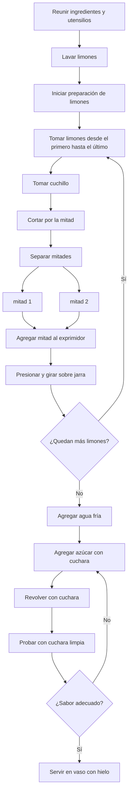

# Parte 2: Algorítmica

**Tabla de contenidos**
* TOC
{:toc}

## Algoritmo

{: .tip-title }
> ¿Qué es un algoritmo?
>
> De acuerdo a la Rae, se define como:
>> *Quizá del lat. tardío *algobarismus, y este abrev. del ár. clás. ḥisābu lḡubār 'cálculo mediante cifras arábigas'.*
>>
>> m. Conjunto ordenado y finito de operaciones que permite hallar la solución de un problema.
    m. Método y notación en las distintas formas del cálculo.

### Idea básica

### Ejecución

## Uso

{: .important-title}
> Información crítica
> 
> En programación, es fundamental comprender el problema a resolver tal que pueda fragmentarse en unidades elementales que puedan ser transformados a código y ejecutados por la computadora.

## Pŕactica personal:

Utiliza las plataformas [draw.io](https://draw.io), canva, microsoft office o cualquier otro programa para diseñar un algoritmo de cómo se prepara un sandwich de cacahuate con mermelada. 

Aquí hay un ejemplo de cómo hacer limonada:

